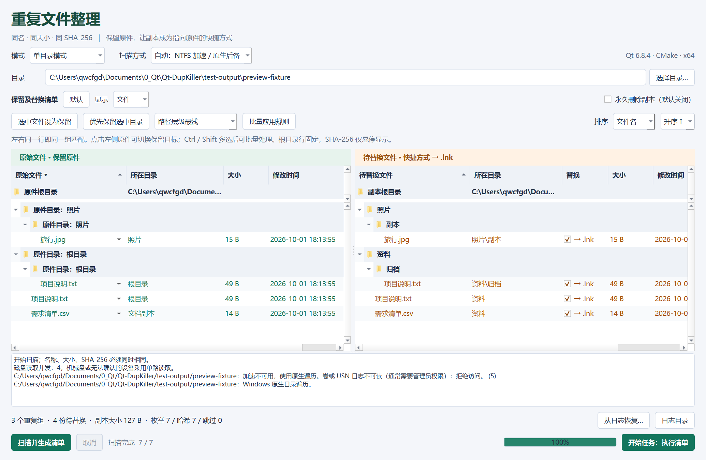
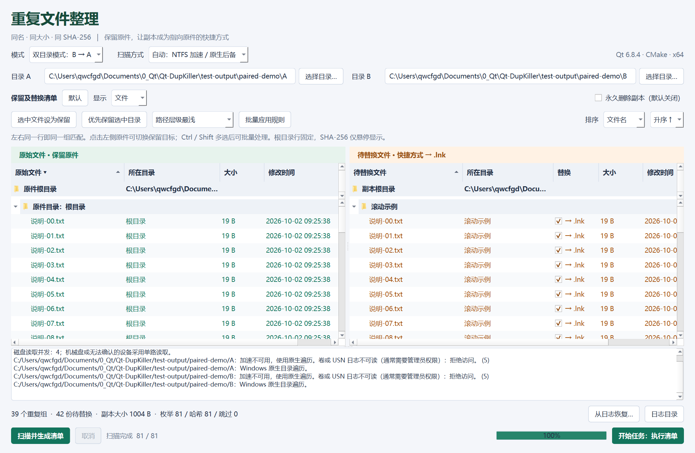
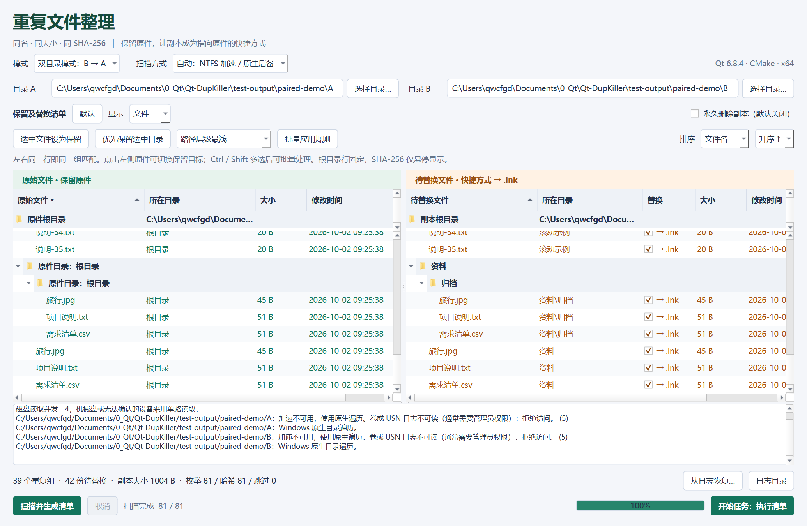

# DupKiller

Windows 10/11 x64 重复文件整理工具，递归校验文件名、大小和 SHA-256，把重复副本替换为指向原件的 Windows 快捷方式。采用 C++17、Qt Widgets、MVVM 和 CMake，同一份源码支持 Qt 5 / Qt 6，已验证 Qt 5.15.19 和 Qt 6.8.4。

## 功能

- 单目录：递归查找**完整名称（区分大小写）、大小、SHA-256 都相同**的文件。默认保留层级最浅的一份，其余候选可替换为同目录的 `原文件名.lnk`。
- 双目录：从 A 选择原件，为 B 中相同文件创建快捷方式。A 中所有原件均保留；B 内独有重复不处理。相对路径不要求相同。
- 单目录模式只显示一个目录输入；双目录的 A/B 输入并排显示。
- 左侧显示保留原件，右侧显示待替换副本，每个副本与它的原件处于同一行；同一原件对应多个副本时重复显示。中央分隔条可拖动调整宽度，两侧同步展开、选择与纵向滚动。
- 清单按副本的文件夹层级组织，原件所在目录显示在左侧。两侧首行始终为固定根目录，即使滚动到列表底部仍可确认当前扫描范围。
- 点击左侧文件名，从下拉列表选择该组的保留原件；右侧勾选/取消副本替换。Ctrl/Shift 多选文件或文件夹后，可设为保留、优先保留选中目录，或批量应用最浅路径/最早修改/最新修改规则。
- “默认”按钮重设所有组的最浅路径保留目标、恢复副本替换勾选并关闭永久删除；目录输入保持不变。“显示”下拉框可切换根目录、所有子目录和按目录层级展开的重复文件，显示方式不改变执行清单。
- “优先替换日期说明目录”规则优先从其他目录选择原件，再按最浅路径及完整路径选取；支持年、年月、完整日期开头的文字说明，例如 `2022.1.1 元旦`、`2017.国庆`。如果一组全部位于日期目录，仍保留至少一份。
- 单目录每组始终有一个链接目标；取消副本替换勾选会保留该副本。双目录的原件选择仅包含 A 中文件，其他 A 文件仍保留。
- 文件名、修改时间、文件类型、大小支持升序/降序，排序仅作用于各层兄弟节点，文件夹始终在文件之前。
- SHA-256 仅在鼠标悬停文件时显示。哈希必须先计算，悬停控制的是显示。
- 永久删除默认不勾选，每次新扫描重置为关闭。默认将副本送入回收站；回收站不可用时失败并回滚，不会自动改为永久删除。
- 后台扫描、有限并发哈希、进度、取消、执行前复查、持久化事务日志和从日志恢复。

## 使用

直接运行 `../build/QtDupKiller-qt6/QtDupKiller.exe` 或 `../build/QtDupKiller-qt5/QtDupKiller.exe`。编译文件和部署依赖均输出到对应目录。分发时请复制 EXE 及部署的 DLL/插件目录。

1. 选择单/双目录及路径，点击“扫描并生成清单”。扫描不修改文件。
2. 检查左右配对清单，点击左侧文件名调整保留目标，在右侧勾选需要替换的副本。悬停文件查看完整路径、重复组和 SHA-256。
3. 可多选文件/目录，使用批量工具。未选择任何行时，批量规则作用于全部重复组。
4. 检查“永久删除副本”选项，点击底部“开始任务：执行清单”并确认。进度条与任务按钮位于最底端同一行；扫描、执行和恢复期间，标题栏显示“任务进行中”。
5. 执行或恢复后重新扫描；旧清单不能再次执行。修改目录/模式/后端也会使清单失效。

`.lnk` 可在资源管理器中双击打开目标，但不提供原文件路径的透明读取能力。原件被删除、移动或所在盘离线时，链接可能失效。修改链接所打开的内容会修改保留原件。

回收站副本尚未释放实际空间；清空回收站后才释放。界面“副本大小”是所选副本逻辑大小，不是精确物理空间收益。压缩/稀疏文件和 `.lnk` 大小也会影响实际收益。

## 界面

下列截图来自程序生成的演示文件，不包含用户测试样本。

单目录：一个目录输入，左右逐行配对。



双目录：A/B 同排，左侧 A 原件，右侧 B 副本。



列表滚动到底部时，两侧根目录行仍固定显示。



## 快速扫描

“自动”模式在已确认无机械寻道开销的本地 NTFS 卷上尝试 `FSCTL_ENUM_USN_DATA` 获取 MFT 文件索引，并用已有 USN 日志校准扫描期间的增量。对一个卷只枚举一次，A/B 共用索引。机械硬盘或无法确认的设备使用目录遍历，避免为一个照片目录读取整个卷的索引。程序不创建、清除或修改 USN 日志。

MFT 卷访问通常需要管理员权限；普通权限、无可用日志、日志截断、未知 USN 格式、挂载点及其他文件系统使用 `FindFirstFileExW(FindExInfoBasic, FIND_FIRST_EX_LARGE_FETCH)` 原生遍历。日志中说明实际采用的后端。对很小的目录，整卷 MFT 枚举可能不划算，可手动选择原生遍历。

原生枚举先用 `FindFirstFileExW` 返回的名称、大小筛选，仅打开可能重复的文件读取完整身份信息。大于 128 KiB 的候选先比较前 64 KiB 摘要，仅用于排除内容不同的文件；保留下来的候选仍计算完整 SHA-256 及命名数据流，执行前再次完整校验。

哈希使用 Windows CNG SHA-256 和 4 MiB 读取块；根据磁盘寻道信息选择 1–4 路读取，机械盘、网络盘或无法确认的设备默认单路，减少随机寻道。进度按实际读取字节更新并限制界面通知频率。扫描索引在哈希前释放，不建立驻留服务或持久化全盘索引。

回收批次对每个卷只做一次回收站预检查，按卷 GUID 在本次任务内缓存，避免逐项重新统计整个回收站。每个文件仍单独验证 Shell 回收结果并写入恢复日志；新任务重新检查，无法确认卷身份时不缓存。

大清单缓存显示字符串及保留选项数量，目录和源模型索引使用哈希表。单项勾选只刷新对应重复组，计数及副本大小增量更新。性能工具 `dup_benchmark` 使用合成数据，不访问真实照片；具体数据与测试环境见 [docs/validation.md](docs/validation.md)。

## 单目录照片批处理

编译目录还包含 `dup_task.exe`。扫描与执行分为两个命令，保存完整文件身份及哈希清单。`--photos` 限定常见照片及相机 RAW 扩展名，视频和其他文件不会进入清单。清单执行固定使用回收站，所有副本由同目录 `.lnk` 替代。

```powershell
# 输出父目录应先创建；清单包含私人文件路径，应自行妥善保存。
../build/QtDupKiller-qt6/dup_task.exe --root C:/Photos --photos --prefer-non-dated `
  --save-plan C:/TaskReports/plan.json --report C:/TaskReports/scan.json
../build/QtDupKiller-qt6/dup_task.exe --execute-plan C:/TaskReports/plan.json `
  --report C:/TaskReports/execution.json
```

执行前会重新验证整个清单的根目录、文件身份、完整 SHA-256 和数据流。报告包含成功/失败数量、快捷方式目标核验及事务日志路径；界面“从日志恢复”可恢复回收站副本。`--hash-workers 1..4` 和 `--no-sampling` 仅用于读取策略的对比测量。

## 排除与边界

递归包含隐藏普通文件；跳过系统文件/系统目录、已有 `.lnk`、硬链接（链接数大于 1）、符号链接/目录联接等重解析点、离线/按需下载文件和事务暂存文件。无法读取或被占用的候选显示跳过原因。只读副本在执行时跳过，不强制更改属性。

支持下载文件常见的 `Zone.Identifier`、`SmartScreen` 及其他 NTFS 命名数据流。主数据满足三个匹配条件后，附加数据流的名称和完整 SHA-256 也必须相同才归为同一组；数据流不同的文件保持独立。替换前再次验证所有数据流，并原样复制到 `.lnk`，随后校验复制结果。A 中原件的数据流、下载安全标记都保留；日志记录数据流哈希，恢复和快捷方式清理同样验证数据流。

A/B 不能相同或互相包含；路径祖先含重解析点时拒绝。名称严格区分大小写，但根目录重叠校验保守地按 Windows 大小写不敏感路径处理。文件持续变化时，结果代表扫描期间发现且成功校验的候选，执行前再次验证文件身份和完整 SHA-256；不会保证扫描时点的全盘原子快照。

## 日志与恢复

日志位于 `%LOCALAPPDATA%/QtDupKiller/QtDupKiller/logs`（界面“日志目录”可直接打开），按事务逐项写入并刷新到磁盘。包括来源、目标、文件身份、哈希、删除模式、暂存路径和结果。

每项执行：锁定父目录及原件/副本 → 再次验证身份、属性、SHA-256 → 创建临时快捷方式 → 验证并发布 `.lnk` → 按句柄将副本改名到同目录的唯一 `.dupkiller-*.pending` → 回收或永久删除 → 提交日志。失败时恢复暂存文件并移除本次创建的快捷方式；恢复遇到同名文件时不覆盖。

“从日志恢复”可以恢复未完成的暂存事务，也可以通过 Windows Shell 把日志关联的回收站副本移回原路径，同时移除仍与日志身份一致的快捷方式。永久删除且已完成的副本无法恢复；回收站已清空或记录对应文件已变化时也无法恢复。完成记录缺失且暂存文件已不在时，保守保留快捷方式并提示人工检查。

## 本机 CMake 构建

本机推荐组合已经写入 `CMakePresets.json`：

| 预设 | Qt | GCC |
|---|---|---|
| `qt5-release` | `C:/Qt/5.15.19/mingw810_64` | `C:/MinGW/8.1.0/mingw64`，8.1.0 |
| `qt6-release` | `C:/Qt/6.8.4/mingw1200_64` | `C:/MinGW/12.0.0/mingw64`，实际 14.2.0 |

```powershell
cmake --preset qt6-release
cmake --build --preset qt6-release
ctest --preset qt6-release
# 将 qt6-release 换为 qt5-release 可构建 Qt 5。
```

构建并部署两套发布目录：

```powershell
powershell -ExecutionPolicy Bypass -File scripts/build-release.ps1
# 单独构建：加 -Qt 5 或 -Qt 6
```

需要 CMake、Ninja，以及 Qt Core / Widgets / Concurrent / Test 模块。脚本调用 `windeployqt` 并从实际 MinGW 目录补齐运行库。预设输出目录为 `../build/QtDupKiller-qt5` 和 `../build/QtDupKiller-qt6`。测试只操作生成的临时数据，回收站测试需要普通桌面用户具备访问系统回收站的权限；受限沙箱可能阻止该测试。

其他电脑可在新的构建目录显式指定工具链：

```powershell
cmake -S . -B ../build/QtDupKiller-qt6 -G Ninja -DCMAKE_BUILD_TYPE=Release `
  -DDUPKILLER_QT_MAJOR=6 -DCMAKE_PREFIX_PATH=C:/YourQtKit `
  -DCMAKE_CXX_COMPILER=C:/YourMinGW/bin/g++.exe
cmake --build ../build/QtDupKiller-qt6
```

开发版运行前应将对应 Qt `bin` 和匹配的 MinGW `bin` 放到 PATH 前部，避免 Qt 5/Qt 6 的 GCC 运行库混用。发布目录已携带依赖。

## 图标与完整样本验证

根目录 `QtDupKiller.ico` 包含 16/24/32/48/64/128/256 像素图标，通过 Windows RC 嵌入 EXE，通过 Qt Resource 设置标题栏和任务栏图标。图案采用两份文档与快捷方式箭头。需要重新生成时执行 `python scripts/create-icon.py`（仅此开发工具需要 Pillow，编译无需 Python）。

`dup_fixture.exe` 用于复现真实文件夹问题：只读源目录，使用 Win32 CopyFileW 建立全新的 A/B 副本，保留数据流，再使用正式扫描和执行代码进行双目录替换。输出目录必须不存在且与源目录分离。报告会校验原始目录与 A 的完整 SHA-256、数据流、修改时间和属性，以及 B 的快捷方式目标和数据流。默认永久删除复制出的 B 文件，加 `--recycle` 可测试回收站方式。

```powershell
../build/QtDupKiller-qt5/dup_fixture.exe --source testsrc --output test-output/new-qt5 --native
../build/QtDupKiller-qt6/dup_fixture.exe --source testsrc --output test-output/new-qt6 --recycle
```

Qt 5、Qt 6 各通过 34 项 QtTest 检查（含初始化、清理与参数化样例）。此前实际 `testsrc` 的独立 A/B 副本验证中，两套程序均将 B 的 96 个文件全部替换为 `.lnk`，原始测试目录及 A 的内容、时间、属性和命名数据流未变。用户样本、测试输出和构建产物均被 `.gitignore` 排除，仓库包含可生成临时数据的测试工具。

详细验证记录和范围见 [docs/validation.md](docs/validation.md)。

## 架构与调研

见 [docs/design.md](docs/design.md)。本项目独立实现 Win32 接口，不依赖 Everything，也未直接复制 GitHub 项目的实现代码。

## 许可证

项目源码使用 [MIT License](LICENSE)。Qt 及其他依赖遵循各自的许可证。
