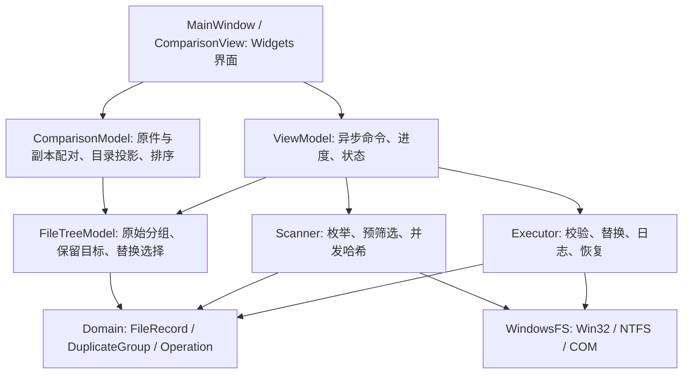

# Qt DupKiller 设计

## 已确认需求

采用 CMake、Qt 5.15.19 / Qt 6.8.4 推荐本机工具链，同源码双构建。单目录和双目录递归匹配严格同名、同大小、同 SHA-256 文件；默认最浅路径，允许逐个及批量保留目标选择。B 仅指向 A，A 原件均保留。快捷方式为同目录 `原文件名.lnk`，冲突跳过。永久删除清单选项默认关闭。目录树支持文件名/修改时间/类型/大小升降序，哈希仅悬停显示。

## MVVM 分层

- View 不进行文件扫描/哈希/删除，只绑定模型、发出操作、展示确认与反馈。
- ViewModel 管理后台任务、取消令牌、任务生命周期、清单是否可执行和信号转发。
- FileTreeModel 保留 Domain 分组身份、原件选择及替换开关，是任务清单的权威来源。
- ComparisonModel 将每个副本投影为一行原件/副本对，以副本文件夹建立层级，并显示左侧原件的实际目录。选择和编辑映射回 FileTreeModel，排序不改变分组及目标关系。
- ComparisonView 用 QSplitter 管理左右宽度；左右视图共享模型和选择模型，同步展开、折叠与纵向滚动。独立根目录视图固定在列表顶部并与正文同步列宽和横向滚动。副本复选框更新不重置模型，保留当前选择、展开和滚动位置。
- Scanner / Executor 可脱离界面独立测试，WindowsFS 封装系统能力。

## 数据与流程

FileRecord 保存完整路径、所属根/A-B、文件名、逻辑大小、卷/文件 ID、修改时间原始 FILETIME、属性、主数据哈希及命名数据流哈希。DuplicateGroup 保存文件集合、单个链接目标和每个副本的替换开关。

扫描根验证 → 每卷共享 MFT/USN 索引或原生遍历 → 读取候选元数据（排除链接/云端等）→ `(完整名称, 大小)` 分桶 → 仅有效桶并发完整 SHA-256 及命名数据流哈希 → `(名称, 大小, SHA-256, 命名流集合)` 分组 → 默认选择 → 目录树清单。

双目录桶必须同时含 A 和 B，最终哈希分组也必须同时含两侧。B 独有重复桶不哈希。单目录名称大小桶至少两项。默认保留以相对根目录的父路径层数计，平局以完整路径字符串稳定排序。

执行使用不可变 Operation 快照；执行中界面不可编辑。根/模式变化、执行或恢复后旧结果失效。每个操作重新按句柄校验文件 ID、卷 ID、大小、修改时间、属性及完整 SHA-256，校验期间拒绝写入共享。目标句柄保持到本项完成；目录句柄拒绝删除共享，防止目录变换。副本通过原句柄改名暂存，避免按旧路径删除另一个新文件。取消在读取块和操作边界生效，已发布的事务先完成或回滚。

快捷方式先写唯一临时文件，验证目标后以不覆盖的原子改名发布。发布前后检查快捷方式文件身份及完整哈希，确认期间未被替换或改写，再记录并锁定。恢复/回滚也检查快捷方式身份及完整哈希。日志分 `prepared / link_created / staged / committed / rolled_back / recovery_required / recovered`，持久化记录失败时尽可能回滚。

命名数据流通过 FindFirstStreamW / FindNextStreamW 枚举，逐流完整 SHA-256；枚举前后核对名称及大小，读取期间拒绝写入。来源的数据流复制到临时 `.lnk`，写入刷新后核对全部哈希，再发布。日志保存每个流的名称和哈希。Windows 的共享模式按流维护，事务所需删除句柄与命名流句柄的共享设置遵循 [Microsoft 文件流说明](https://learn.microsoft.com/en-us/windows/win32/fileio/file-streams)。未移除下载标记，也不执行任何测试样本内的 EXE。

底部任务栏统一放置扫描、取消、阶段、进度和开始执行按钮，忙碌状态同步更新标题。根目录多尺寸 ICO 分别通过 RC（EXE 图标）和 QRC（应用/窗口图标）加载，源图标可由 scripts/create-icon.py 重建。

目录输入位于同一水平布局；单目录隐藏 B 面板，双目录同时展示 A/B。原件文件名通过下拉编辑器选择链接目标，双目录只允许 A 中的文件。SHA-256 只通过对应文件的 tooltip 展示。冻结根目录行使用当前样式的实际表头及行高度，避免字体变化后根行被裁切。

默认回收通过 `IFileOperation`，只允许本地固定磁盘、确认可用的回收站，并在回调中拒绝非回收标志，检查回收项目结果。日志保留回收项目的 PIDL 和物理位置，恢复时验证二者及文件身份后通过 Shell MoveItem 恢复。系统 Shell 在某些情况下留下的关联 `$I` 索引，仅在身份及完整哈希仍与本次回收后的记录一致时清理，不解析索引的内部数据格式。永久删除使用副本句柄的 FileDispositionInfo。未知结果保留原件/暂存文件及日志供检查，不自动降级为永久删除。

## 快速枚举选择

| 参考 | 结论 |
|---|---|
| [voidtools/ES](https://github.com/voidtools/ES) | 官方 C 命令行接口，可参考 Everything IPC 集成；本项目不依赖它。 |
| [Everything SDK](https://www.voidtools.com/support/everything/sdk/) | 依赖后台 Everything 客户端，与本次独立加速要求不符。 |
| [ChrisS85/FastFileSearch](https://github.com/ChrisS85/FastFileSearch) | 参考 NTFS USN 枚举架构，独立编写 Win32 实现。 |
| [FSCTL_ENUM_USN_DATA](https://learn.microsoft.com/en-us/windows/win32/api/winioctl/ni-winioctl-fsctl_enum_usn_data) | 使用 MFT 文件参考号及父节点还原所选目录子树，NTFS 且需卷访问。 |
| [FindFirstFileExW](https://learn.microsoft.com/en-us/windows/win32/api/fileapi/nf-fileapi-findfirstfileexw) | 使用 Basic 信息级别及大缓冲查询作为普适后备。 |
| [Windows Shell Links](https://learn.microsoft.com/en-us/windows/win32/shell/links) | IShellLinkW / IPersistFile 实现标准 `.lnk`。 |

只解析已知 V2 USN 布局（兼容本机 MinGW 的 USN_RECORD 类型名称），严格检查缓冲区、文件名范围和增量前进。未知格式、日志代次变化、被截断或读取失败即回退。通过有界 USN 检查点合并枚举期间的新增/删除/重命名，候选仍从真实文件句柄读取当前大小/时间。无需直接解析 `$MFT` 原始磁盘字节，也不写卷。

## 验证范围

QtTest 覆盖三条件匹配、不同名称/大小/内容/大小写、单/双目录语义、A 保护、隐藏/系统/硬链接排除、命名流匹配/差异/变化拒绝、数据流完整保留及回收恢复、占用、根重叠、取消、USN 缓冲区边界、模型一致性与持久索引排序、批量保留和 SHA-256 显示、永久删除（普通/空/中文文件）、同时间同大小内容变化、快捷方式冲突、实际回收站与 Shell 恢复、模拟中断日志恢复、异步 ViewModel、底部进度布局、运行中标题及窗口图标。双栏测试进一步覆盖一对多配对、逐项选择原件、A/B 目标限制、目录输入切换、冻结根行、同步滚动/展开/选择、分隔条尺寸以及勾选后保持滚动位置。

UI smoke 模式只读扫描测试样本并导出窗口截图，不执行替换。单元测试数据生成在指定构建目录。dup_fixture 为 testsrc 建立独立 A/B 副本，全量校验并测试真实替换；原始 testsrc 始终只读。

本次普通权限环境验证了自动后端回退、USN 解析及真实回收站；完整 MFT 卷枚举在具有管理员权限和可用 NTFS USN 日志的运行环境才能验证，首版未宣称固定枚举速度或与 Everything 相同的全盘耗时。
